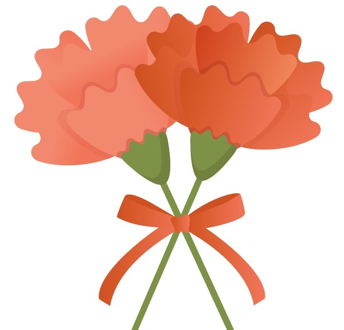

## About Me (Chronological Order) 

Hello! I'm an incoming [MCS](https://siebelschool.illinois.edu/academics/graduate/professional-mcs/campus-master-computer-science) student at the [University of Illinois at Urbana-Champaign (UIUC)](https://illinois.edu) where I am receiving an informal mentorship from [BLENDER](https://blender.cs.illinois.edu/). At the same time, I am receiving informal advising under the Prof. [Bohyung Han](https://scholar.google.com/citations?hl=ko&user=9aaeCToAAAAJ) and Prof. [Jae Sung Lee](https://scholar.google.com/citations?user=NXlghNYAAAAJ&hl=ko&oi=ao) (alphabetical order) in [Seoul National University](https://www.snu.ac.kr/), where I also received an M.S. degree in artificial intelligence. 

Previously, in [KAIST](https://www.kaist.ac.kr/kr/), I received advising by Prof. [Jong Chul Ye](https://scholar.google.com/citations?hl=ko&user=HNMjoNEAAAAJ). I hold a B.S. in [Computer Science from Ewha Womans University](https://cse.ewha.ac.kr/cse/index.do), where I worked on a Capstone Design Project advised by Prof. [Hieonn Kim](https://kr.linkedin.com/in/%ED%98%84%EC%88%98-%EA%B9%80-50424a18b) and Prof. [Dongbo Min](https://scholar.google.com/citations?hl=ko&user=3REUPXYAAAAJ&view_op=list_works&citft=1&email_for_op=hb0522%40snu.ac.kr&gmla=ANZ5fUP63sEo98hY2CF0Pn0c1c1yJexX52ZO4Z1Cv1xrY5T2718Wo2It5ehKtC_dbGYP63mxbQrAXzQYNX_VzNrX13d0AlxojZmrbvoZhHGjTlfm4Gr5Zc7msf79C0eR1FQpDZOYzThQOvxnMcf4eGZzihKvhyoqjKjHwwwXyDjkpY-P0X4YL-TpDikp9F1OGlp6ubqYWVuSaflB0UIXVDhuAFrjgyLaedOFQWAZPc77-aiTdH968zOYjunXR3v3sm94eQ).

## Research
I am especially interested in improving LLMs' capabilities for the future superhuman applications in robotics and medicine.

## News
- **[Sep. 2025]** Will join UIUC as an MCS student!
- **[May. 2025]** Started to receive informal mentorship from BLENDER.
- **[Jan. 2025]** One paper about Federated Learning is accepted to Neurocomputing.
- **[Sep. 2024]** One paper about a new learning paradigm is accepted to Scientific Reports.

## Awards & Honors
- **Outstanding poster award**, Korean Society of Imaging Informatics in Medicine, 2024
- **Outstanding poster award**, Institute of Radiation Medicine in Seoul National University, 2024
- **Outstanding oral presentation award**, Korea Society of Artificial Intelligence in Medicine, 2023
- **Outstanding research award**, IEEE NPSS Seoul Chapter, 2023
- **Outstanding poster award**, Korea Society of Artificial Intelligence in Medicine, 2022
- **Honors Graduate**, Department of Computer Science, Ewha Womans University, 2022
- **Top prize**, Capstone Design Project Competition in Ewha, 2021
- **Grand prize**, Start-up Competition in Ewha Womans University, 2021
- **Outstanding paper award**, Journal of Korean Institute of Information Technology, 2021
- **Outstanding paper award**, Journal of Korean Institute of Information Technology, 2021



## Service
- Teaching Assistant, Medical Physics, Seoul National University, 2024  
- Teaching Assistant, Seminar on the Science of Innovation (temporary), Seoul National University, 2024  
- Teaching Assistant, Software Leadership Seminar, Ewha Womans University, 2020  
- Teaching Assistant, Chapel, Ewha Womans University, 2019
- President, BanU (abandoned animal volunteer club), Ewha Womans University
